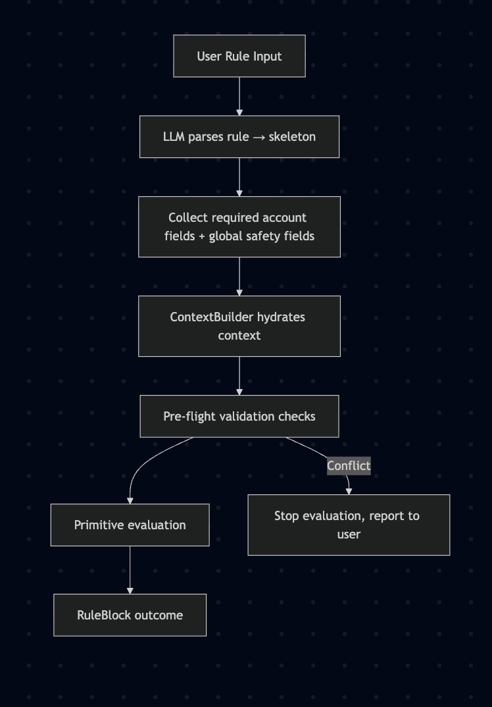

# Trading DSL Engine

This repository contains the core implementation of a deterministic trading-rule DSL (Domain Specific Language) for real-time strategy supervision, enforcement, and analytics. The system allows defining complex trading rules as combinations of reusable primitives, validated and executed deterministically on a structured evaluation context.

---

## Directory Structure

* `primitives.py` : Contains the definitions of all **core primitives** and their **evaluator functions**.
* `engine.py` (or main engine file) : Contains the **RuleBlock, Primitive, PrimitiveRegistry, and RuleEngine classes**.

---

## Core Concepts

### 1. Primitive

A **Primitive** represents the smallest atomic operation that can be evaluated. Each primitive has:

* `name`: Unique identifier.
* `evaluator(params, context) -> bool`: Function that performs the evaluation given parameters and runtime context.

Example primitives:

* `comparison`: Checks if X is above/below/equal to Y.
* `set_membership`: Checks if a value is allowed in a set.
* `rate_limit`: Checks frequency over a time window.
* `accumulation`: Checks running totals or metrics.
* `sequence`: Detects event sequences.
* `temporal_gate`: Checks temporal constraints (market hours, cooldowns).

### 2. PrimitiveRegistry

The **PrimitiveRegistry** is a global store for all primitives:

* Allows registering primitives once.
* Provides deterministic lookup for evaluating rules.
* Ensures that extensions generated by the LLM only reference existing primitives.

Example usage:

```python
PrimitiveRegistry.register(Primitive("comparison", comparison_evaluator))
p = PrimitiveRegistry.get("comparison")
```

### 3. RuleBlock

Represents a **category of rules** (ENTRY, RISK, DISCIPLINE, EXIT, PROCESS, OVERRIDES) and contains:

* `extensions[]`: List of extensions, each referencing a primitive and parameters.
* `conditions{}`: Logical combinators (`all`, `any`, `none`) to determine the RuleBlock outcome.

### 4. RuleEngine

Aggregates multiple RuleBlocks into a **full playbook**. Responsibilities:

* Validates extensions and conditions.
* Evaluates RuleBlocks in real-time given an **EvalContext**.
* Maps results to enforcement actions (e.g., block trade, enforce cooldown, adjust size).
* Logs decisions for later analysis.

### 5. EvalContext

A structured dictionary containing the **current market state, account state, and event history**. This is what primitives evaluate against.

Not curently implemented, but the data preprocessing layer should be able to output something like this below.

Example:

```python
context = {
    "rsi_14": 65,
    "symbol": "ES",
    "current_time": 1766451660,
    "history": {"trades_per_hour": [timestamp1, timestamp2]},
    "event_history": [(timestamp, "loss"), (timestamp, "win")]
}
```

---

## Example Usage

```python
from primitives import *
from engine import Primitive, PrimitiveRegistry, RuleBlock

# Register core primitives
# primitives are added on a class level
# as there is no need for different instances of the same registry
PrimitiveRegistry.register(Primitive("comparison", comparison_evaluator))
PrimitiveRegistry.register(Primitive("set_membership", set_membership_evaluator))
# ... register other primitives

# Example RuleBlock
entry_rule = RuleBlock(
    category="ENTRY",
    extensions=[
        Extension("comparison", {"left": "rsi_14", "op": ">", "right": 60}, "entry_rsi_ok"),
        Extension("set_membership", {"field": "symbol", "allowed": ["ES", "NQ"]}, "allowed_symbol")
    ],
    conditions={"all": ["entry_rsi_ok", "allowed_symbol"]}
)

# Evaluate RuleBlock
result = entry_rule.evaluate(context)
print(result)  # True/False
```

---

## Core Primitives Defined

1. **comparison**: Is X above/below/equal to Y?
2. **set_membership**: Is X allowed in an allowed set or forbidden in a forbidden set?
3. **rate_limit**: How often did something occur over a time window?
4. **accumulation**: Running totals of metrics, e.g., daily PnL, time in trade.
5. **sequence**: Detects if events occurred in a specific order within a window.
6. **temporal_gate**: Checks if action is allowed given temporal constraints (market hours, cooldowns, news windows).

---

## Current Flow


## Notes

* The system assumes that raw market data (OHLC bars) is preprocessed into an **EvalContext** containing derived metrics and event history.
* The DSL is fully deterministic and modular, allowing LLM-generated rules to be **validated, confirmed, and materialized** into executable RuleBlocks.
* Extensions and primitives are decoupled, making it easy to **add new primitives** without changing the engine core.

---

## Next Steps

* Implement preprocessing of raw OHLC bars into EvalContext.
* Implement RuleEngine enforcement actions (ENTRY, DISCIPLINE, RISK, EXIT, OVERRIDES).
* Integrate LLM direct mapping to automatically populate RuleBlocks from trader instructions.
* Add a field that marks the priority of each category for the trader
* finalize the data cleaning pipeline
* keep buffers of data from api in case of failures (keep functionality atomic)
* look at custom limits for aws services
* as time goes on, deactivate rules that are not needed anymore like entry rules
* instead of making a new instance of the engine when chaning the rules, just change the current one and store what was changed in the database so it can be used during backtesting
* create system architecture diagram
* if state is in cooldown, block the trade button and then if the trader clicks on it, there will be anotif saying "are you sure" and then the trader can decide
* Engine is market agnostic
* if there is not enough supply for your demand in your limit order, do a partial fill and then if there still is not enough supply after a certain period of time, then just cancel that order
* test the engine during the market hours and test the engine multiple times to know that it is performing accurately and deterministically
## Websocket To-Do
* Add some randomness to the reconnection of the websocket if the websocket fails because everyone is going to try to reconnect to the same socket at once.
* try to have the least number of websocket connections to binance
* Look at these best practices and limits: https://www.binance.com/en/academy/articles/what-are-binance-websocket-limits?utm_source=chatgpt.com
* add a token expiration and a revocation path

